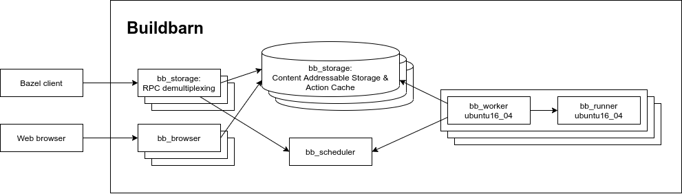

# Example deployments of Buildbarn

This repository contains a set of scripts and configuration files that
can be used to deploy Buildbarn on various platforms. Buildbarn is
pretty flexible, in that it can both be used for single-node remote
caching setups and large-scale remote execution setups. Unless noted
otherwise, the configurations in this repository all use assume the
following setup:

- [Sharded](https://en.wikipedia.org/wiki/Sharding) storage, using
  [the Buildbarn storage daemon](https://github.com/buildbarn/bb-storage).
  To apply the sharding to client RPCs, a separate set of stateless
  frontend servers is used to fan out requests.
- [Remote execution](https://github.com/buildbarn/bb-remote-execution)
  of build actions, using container images from
  [Act](https://github.com/nektos/act/blob/master/IMAGES.md), distributed by
  [catthehacker](https://github.com/catthehacker/docker_images), used for
  running GitHub Actions locally under Ubuntu 22.04.
- An installation of [the Buildbarn Browser](https://github.com/buildbarn/bb-browser).

Below is a diagram of what this setup Buildbarn looks like. In this
diagram, the arrows represent the direction in which network connections
are established.

<p align="center">
  
</p>

## Current versions

This repository currently demonstrates the following versions.
Binaries can be found under the CI Build link,
at the top right in the GitHub Actions page.

| Repository | Container images and binaries |
| ---------- | ----------------------------- |
| [bb-browser](https://github.com/buildbarn/bb-browser) [`5d2ed98e07`](https://github.com/buildbarn/bb-browser/commits/5d2ed98e07561fdad8b50d995e9b1a76d4a96450)<br/>2025-08-14 05:23:51 UTC | [ghcr.io/buildbarn/bb-browser:20250814T052351Z-5d2ed98](https://ghcr.io/buildbarn/bb-browser:20250814T052351Z-5d2ed98)<br/>[CI artifacts](https://github.com/buildbarn/bb-browser/actions/runs/16956646741) |
| [bb-remote-execution](https://github.com/buildbarn/bb-remote-execution) [`efef252cdf`](https://github.com/buildbarn/bb-remote-execution/commits/efef252cdf4f97cc0154ea02976ed1322587e599)<br/>2025-08-20 08:16:13 UTC | [ghcr.io/buildbarn/bb-runner-installer:20250820T081613Z-efef252](https://ghcr.io/buildbarn/bb-runner-installer:20250820T081613Z-efef252)<br/>[ghcr.io/buildbarn/bb-scheduler:20250820T081613Z-efef252](https://ghcr.io/buildbarn/bb-scheduler:20250820T081613Z-efef252)<br/>[ghcr.io/buildbarn/bb-worker:20250820T081613Z-efef252](https://ghcr.io/buildbarn/bb-worker:20250820T081613Z-efef252)<br/>[CI artifacts](https://github.com/buildbarn/bb-remote-execution/actions/runs/17092658990) |
| [bb-storage](https://github.com/buildbarn/bb-storage) [`fd11d3e1b0`](https://github.com/buildbarn/bb-storage/commits/fd11d3e1b0b435165c5e37254ac5d265e7999cb8)<br/>2025-08-19 19:38:52 UTC | [ghcr.io/buildbarn/bb-storage:20250819T193852Z-fd11d3e](https://ghcr.io/buildbarn/bb-storage:20250819T193852Z-fd11d3e)<br/>[CI artifacts](https://github.com/buildbarn/bb-storage/actions/runs/17079992777) |

## Changelog

A changelog for each update to `bb-deployments` is maintained in [changelog.md](changelog.md).

The [Meroton blog](https://meroton.com/blog/tags/buildbarn/)
describes some of the changes and features in more detail
and includes Jsonnet configuration migration examples.

# Getting started

This example aims to showcase a very simple build and test with remote execution
using docker-compose as the deployment for Buildbarn. We will be compiling
examples from the [abseil-hello](https://github.com/abseil/abseil-hello) project
using Bazel.

## Recommended setup

First clone the repo and start up a docker-compose example:
```
git clone https://github.com/buildbarn/bb-deployments.git
cd bb-deployments/docker-compose
./run.sh
```

You may see initially see an error message along the lines of:
```
worker-ubuntu22-04_1  | xxxx/xx/xx xx:xx:xx rpc error: code = Unavailable desc = Failed to ...: connection error: desc = "transport: Error while dialing dial tcp xxx.xx.x.x:xxxx: connect: connection refused"
```

This is usually because container of the worker has started before the scheduler
or runner and so it cannot connect to them. After a second or so, this error
message should stop.

## Platform properties

For clients to be able to use Buildbarn, clients need to send actions with platform properties that
match the platform properties that Buildbarn workers register themselves with.

For Bazel clients, platform properties can be set in the `.bazelrc` or as command line parameters:

```
--remote_default_exec_properties=OSFamily=Linux
--remote_default_exec_properties=container-image=docker://marketplace.gcr.io/google/rbe-ubuntu16-04@sha256:b516a2d69537cb40a7c6a7d92d0008abb29fba8725243772bdaf2c83f1be2272
```

Note this is only necessary when the [bazel-toolchains](https://github.com/bazelbuild/bazel-toolchains) repository is not being used. Otherwise, platform properties are set via the [bazel platform](https://github.com/bazelbuild/bazel-toolchains/blob/master/configs/ubuntu16_04_clang/11.0.0/bazel_3.1.0/config/BUILD#L43) selected in [`rbe_autoconfig`](https://github.com/buildbarn/bb-deployments/blob/master/WORKSPACE#L93), and referenced using the [`--extra_execution_platforms`](https://github.com/buildbarn/bb-deployments/blob/master/bazelrc#L4) parameter.

Buildbarn workers are configured with its associated `.jsonnet` configuration file as part of the [runner](https://github.com/buildbarn/bb-remote-execution/blob/master/pkg/proto/configuration/bb_worker/bb_worker.proto#L102) configuration.

```
# See worker-ubuntu16-04.jsonnet for the full worker configuration.
  runners: [{
    # .. Additional runner configuration here
    platform: {
      properties: [
        { name: 'OSFamily', value: 'Linux' },
        { name: 'container-image', value: 'docker://marketplace.gcr.io/google/rbe-ubuntu16-04@sha256:b516a2d69537cb40a7c6a7d92d0008abb29fba8725243772bdaf2c83f1be2272' },
      ],
    },
  }],
```

## Remote execution

Bazel can perform remote builds against these deployments by using toolchains
adapted to the remote environment. The script
`tools/remote-toolchains/extract-bazel-auto-toolchains.sh` has been used to
construct such a C++ toolchain which is activated using
`--config=remote-ubuntu-22-04`, see `.bazelrc` and `WORKSPACE` for the exact
setup.

Note that the name and SHA of the container image is configured in multiple
places: `BUILD.bazel`, `.jsonnet` configuration for Buildbarn and for the actual
runner container (docker compose, kubernetes yaml, etc...)

Now try a build (using `bazel` or [`bazelisk`](https://github.com/bazelbuild/bazelisk)):
```
bazel build --config=remote-ubuntu-22-04 @abseil-hello//:hello_main
```

The output should look something like:
```
INFO: 33 processes: 4 internal, 29 remote.
INFO: Build completed successfully, 33 total actions
```

You can check to see if the binary has built successfully by trying:
```
bazel run --config=remote-ubuntu-22-04 @abseil-hello//:hello_main
```
You may experience problems with wrong version of glibc compared to what the
remote is building for.

Equally, you can try to execute a test remotely:
```
bazel test --config=remote-ubuntu-22-04 @abseil-hello//:hello_test
```

Which will give you an output containing something like:
```
INFO: 49 processes: 4 internal, 45 remote.
INFO: Build completed successfully, 49 total actions
@abseil-hello//:hello_test                                     PASSED in 0.1s

Executed 1 out of 1 test: 1 test passes.
```
You might experience problems loading `abseil-hellos/libhello.so`, in which case
you can link statically by using `--dynamic_mode=off`.

Next, we will try out the remote caching capability. If you clean your local
build cache and then rerun a build:
```
bazel clean
bazel build --config=remote-ubuntu-22-04 @abseil-hello//:hello_main
```

You'll see an output containing information that we hit the remote cache instead
of executing on a worker.

## Other Build Clients

### Buck2

There is a Buildbarn example in the Buck2 repository: [here](https://github.com/facebook/buck2/tree/main/examples/remote_execution/buildbarn)
Platform properties are defined in [platform/defs.bzl](https://github.com/facebook/buck2/blob/main/examples/remote_execution/buildbarn/platforms/defs.bzl)
and the rpc endpoints are set in [.buckconfig](https://github.com/facebook/buck2/blob/main/examples/remote_execution/buildbarn/.buckconfig).

### Pants

Pants defines the endpoint and the properties in the main configuration file `pants.toml`.

```
[GLOBAL]
remote_cache_read = true
remote_cache_write = true
remote_store_address = "grpc://localhost:8980"
remote_execution_address = "grpc://localhost:8980"
remote_execution = true
remote_instance_name = "fuse"
remote_execution_extra_platform_properties = [
  "OSFamily=linux",
  "container-image=docker://ghcr.io/catthehacker/ubuntu:act-22.04@sha256:5f9c35c25db1d51a8ddaae5c0ba8d3c163c5e9a4a6cc97acd409ac7eae239448",
]
```

### Goma

It is possible to use `goma`, the buildsystem in the `chromium` project with `Buildbarn`.
The instructions are available here: [docs/goma.md](docs/goma.md).

### Bazel without a remote toolchain

You do not need to define a toolchain for remote execution, like this repository does.
For simple projects where all actions can build with the same executors
you can use set the platform properties as command line arguments.

```
bazel build \
    --remote_executor=grpc://localhost:8980 \
    --remote_instance_name=fuse \
    --remote_default_exec_properties OSFamily=linux \
    --remote_default_exec_properties container-image="docker://ghcr.io/catthehacker/ubuntu:act-22.04@sha256:5f9c35c25db1d51a8ddaae5c0ba8d3c163c5e9a4a6cc97acd409ac7eae239448" \
    @abseil-hello//:hello_main
```

# Join us on Slack!

There is a [#buildbarn channel on buildteamworld.slack.com](https://bit.ly/2SG1amT)
that you can join to get in touch with other people who use and hack on
Buildbarn.

# Commercial Support & Hosting

Via our [partners](https://github.com/buildbarn#commercial-support) commercial support & hosting can be procured.

# Maintenance instructions

## Updating Buildbarn version

First make sure the different Buildbarn components are in sync. Then perform:

```bash
# Update go.mod.
go mod tidy -e

bazelisk run //:buildifier.check

# Update the Kubernetes and Docker compose deployments.
./tools/update-container-image-versions.sh
```

## Update MODULE.bazel

After updating all the go deps we must also update the module file
to be roughly in sync with the other Buildbarn components.
bb-storage and bb-remote-execution often differ a bit,
then we to lean towards the storage view
and apply any manual fix-ups to make sure everything builds.

The most important goal of the repo is to have the images
and the configurations consistent which does not involve the module file.
Its secondary goal is to be a development substrate
and best-effort collection of component versions that work together.
The foremost consumer of that is the bare deployment that build
all the components from source.
This helps developer create new features in individual components
and cross-cutting functionality for multiples.

Acceptance criteria on maintaining the module is that the bare deployment works.

## Formatting

A number of linting and formatting steps are performed in the GitHub Actions flow.
Some of the steps are:

```bash
# Gazelle
bazel run //:gazelle -- update-repos -from_file=go.mod -to_macro go_dependencies.bzl%go_dependencies -prune
bazel run //:gazelle
# Buildifier
bazel run //:buildifier.check
# Gofmt
bazel run @cc_mvdan_gofumpt//:gofumpt -- -w -extra $PWD
# Golint
bazel run @org_golang_x_lint//golint -- -set_exit_status $PWD/...
```

## CI: Manual adjustments

### The module lock file sometime changes

It is annoying to keep it up-to date. It seems to depend on the host system setup.
The best way to solve CI errors is just to download the suggested patch from the action and apply it directly.

* Open the failing Github action.
* Click 'Download log archive' in the cog menu in the upper right.
* Unpack the archive.
* Format a useful patch from `logs/build_and_test/13_Test style conformance.txt`.

Rough inspiration:
```
cp ~/Downloads/logs_*.zip .
aunpack logs_*.zip
cp logs_*/build_and_test/*'_Test style conformance.txt' lockfile.patch
# Remove git action metadata
sed -i -e '1,4d' -e '$d' lockfile.patch
# Remove timestamps
sed -i -E 's/^.{29}//' lockfile.patch

git apply lockfile.patch
git add MODULE.bazel.lock
```
